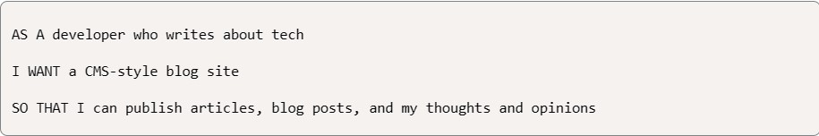

# tech_blog 💻

## Description
For this assignment, the challenge was to create a CMS-style blog site, where users and or developers can publish their blog posts and comment on other post(s). The application has been built was no pre-written code.  

The application will be deployed on Heroku. 

The goal was to implement the MVC paradigm using Handlebars.js, Sequelize as the ORM, and the express-session npm package for authentication.  

## Code Contributors
This was not a group assignment; this homework assignment was completed by each student individually.  

## User Story
For this portion, the user story is represented by the UPenn Module 14 instruction layout. This image has been received directly from Module 14's submission page. 

## Acceptance Criteria 
The project is complete when all Module #14 assignment criteria are met.  Below is an **image from the UPENN bootcamp Module #14** showing the acceptance criteria for direct reference.  The image was not created by Paul Nixon.

## Deployment

URL to the GitHub Repository:  

URL to the deployed application:  

Deployed Video using Heroku to deploy the page!